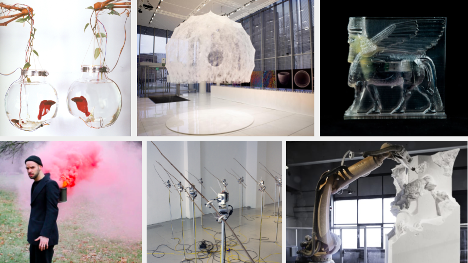

# VIS146A: Computer Controlled Fabrication and Art 1 - Fall 2024
[Schedule](#schedule) | [Description](#description) | [Resources](#resources) | [Grading](#grading) | [Policies](#policies) | [References](#references)

*Clockwise from top left: [Ken Rinaldo - Mediated Encounters](https://www.kenrinaldo.com/portfolio/mediated-encounters/); [MIT Mediated Matter Group - Silk Pavillion](https://www.media.mit.edu/projects/silk-pavilion/overview/); [Morehshin Allahyari - Material Spectulation](http://www.morehshin.com/material-speculation-isis/); [Quayola - Carvings](https://www.cnn.com/style/article/davide-quayola-laocoon-robot-sculpture-smart-creativity/index.html); [David Bowen - Space Junk](https://www.dwbowen.com/spacejunk); [James Loh - Amae Apparatus](https://process.jonas-loh.com/post/7800652708/intimateethnography-title-amae-apparatus)*

# Description

This course introduces computer controlled fabrication for the arts. We cover 3d scanning and photogrammetry; 3d modeling and computer aided design; rapid prototyping and digital fabrication; additive and subtractive fabrication; creating workflows that move from analog to digital to analog. We explore these techniques through arts topics including wearable technologies, mechatronic automation, and approaches including Systems Art, Generative Art, Cybernetic Art and more. Class activities are contextualized through the history of emerging technology and computing and the arts practice.

## Details

- **Instructor:** Dr. Robert Twomey
- **Class:** Tu/Th 9:30-10:50 AM
- **Location:** [SME](https://map.concept3d.com/?id=1005#!ct/18312,63891,65653?s/SME_Main) 302 (Classroom opposite Envision Maker Space)
- **Office Hours:**
  - in person: Thursday 11-noon (Envision)
  - online: Friday noon-1pm (Discord)

## Course objectives
-	Experiential learning.
-	To gain a working understanding of 3d modeling software and 3d capture, as ways to create and manipulate form on a computer. 
-	To become familiar with digital fabrication workflow: the steps to get from 3d models and digital designs to physical objects.
-	To gain experience with hardware and digital fabrication as means of creative production.
-	To learn the fundamentals of safe equipment operation and maintenance for all processes introduced in class. 

A student who successfully completes this course will:
-	Be able to design and fabricate physical objects with a variety of 3d modeling and digital capture technologies. 
-	Have a working knowledge of projects and practitioners employing digital fabrication and hardware techniques.
-	Demonstrate a satisfactory ability to critique and engage in a discussion about creative work employing digital fabrication and hardware-based interaction.
-	Be able to think critically about computer-aided design and fabrication methods and relate them to historical art methods.

**Prequisites:** VIS142 or permission of instructor.

# Resources
- **Canvas:** [https://canvas.ucsd.edu/courses/60628](https://canvas.ucsd.edu/courses/60628)
- **Discord:** check canvas
- **[Rhino 3d](https://www.rhino3d.com/)**
  - **[Grasshopper](https://www.grasshopper3d.com/)**
- **Envision Makerspace:** [https://jacobsschool.ucsd.edu/envision](https://jacobsschool.ucsd.edu/envision)
  - EnVision is located on the 3rd floor of the SME building, rooms 301 - 306
  - We are open M-F, 9a - 8p and Sat/Sun, 12p - 4p
- Design Innovation Building (DIB) Makerspace [https://makerspace.ucsd.edu/](https://makerspace.ucsd.edu/)
- [Ultimaker](https://ultimaker.com/software/ultimaker-cura/)
- [Prusa MK3S+](https://www.prusa3d.com/category/original-prusa-i3-mk3s/)
- Muse laser engraver

# Reference
- [Rhino Quickstart](references/rhino3d.md)
- [Laser Cutting Guide](references/laser-cutting.md)
- [Where to get Materials](references/materials.md)

# Schedule
(Subject to change. Check back for most up to date information)

| Week | Topic |
|------|-------|
| 0.1 | **[Intro and Overview](sessions/week0-1.md#agenda)**   - Course Policies; Envision orientation; Sign up for Discord   - Install Rhino   - **HW** [Exercise 1: Stencil](exercises/ex1.md)|
| 1.1 | **[Rhino 2D basics](sessions/week1-1.md#agenda)**   - Rhino demo 2D Basics; Laser cutter demo |
| 1.2 | **[Laser Cutting, Tabs and Slots](sessions/week1-2#agenda)**   - Laser materials and settings; Finger Joints, Tabs and Slts   - Tab and Slot Demo   - **HW** [Exercise 1.5: Fabricate the Stencil](exercises/ex1#part-2-fabricate)  - **HW** [Exercise 2: 3D Tab and Slot](exercises/ex2)|
| 2.1 | **[Laser to 3d: Stacked Contours](sessions/week2-1.md)**   - Review tab and slot designs   - Stacked Contours |
| 2.2 | **[More Mesh Creation and Contour Extraction](sessions/week2-2.md)**   - **HW** [Exercise 3: Stacked Contours](exercises/ex3)   - **HW** [Project 1: Flat Pack Future](projects/project1.md) | 
| 3.1 | **[Solid Operations in Rhino](sessions/week3-1.md)**   - 3d basics   - solids in Rhino   - booleans |
| 3.2 | **[Unrolling Surfaces](sessions/week3-2.md)**   - unrolling surfaces   - folded paper   - Project 1 Individual Meetings   - **HW** [Exercise 4: Papercraft](exercises/ex4)   - **HW** Work on Project 1|
| 4.1 | **[Intro to 3D Printing](sessions/week4-1.md)**   - Meshes and Wire Cut    - cleaning/editing meshes for 3DP   - **HW** [Exercise 5: Trophy](exercises/ex5)|
| 4.2 | **DIB Introduction**   - Meet at DIB |
| 5.1 | **Critique Project 1**   - In class Critique |
| 5.2 | **[Dimensioning Objects](sessions/week5-2.md)**   - measuring with calipers   - dimensioned drawings   - **HW** [Exercise 6: Digital Double](exercises/ex6) |
| 6.1 | **[3d Scanning, and Photogrammetry](sessions/week6-1.md)**   - 3d scanning technique   - Cleaning/working with Scans | 
| 6.2 | **[Scanning Spaces](sessions/week6-2.md)**   - Scanning Spaces |
| 7.1 | **[Detailed Mesh Editing](sessions/week7-1.md)** - Conclude mesh edit demo   **HW** [Project 2: Hybrid Object](projects/project2.md) ** | 
| 7.2 | **[One-on-Ones and Work Time](sessions/week7-2.md)**   - check in on Project 2 ideas. Finish exercises. |
| 8.1 | Project 2 Work Time |
| 8.2 | **[Project 2 Work Time](sessions/week8-2.md)** |
| 9.1 | **Project 2 Critique**   - In class Critique | 
| 9.2 | Thanksgiving Holiday - No Class |
| 10.1 | **Finish Project 2 Critique** |
| 10.2 | **Project 3 Work Time**   - One on one meetings, Proj 3   - Project 3 Work Time | 
| Finals | **Submit Documentation** |

<!--
Leftovers 
- Magnets
- Shopbot and large fabrication
- Smart Textiles; Digital Craft 
- High/Low Tech (ex13)
- Wearables, Embodiment, Somatic Interface, Augmentation/Prosthesis
- “The Pleasure of Being the Cause” or Somatic Interface (ex14)
-->

# Grading

## Graded activities
- 40% Exercises – approximately 8 weekly exercises
- 45% Projects – 3 total at approximately 15% each
- 10% Digital Sketchbook - cumulative
- 5% Participation

Work will be evaluated on the quality of concept, the degree of experimentation (both aesthetic and technical), and final realization (again, aesthetic and technical). Prompts and rubrics will be provided with more specific details regarding each assignment and breakdowns

## Description of Assignments and Exams

__*Exercises*__
We will have regular, weekly assignments employing the tools and techniques covered in class. These will be short activities with clearly stated creative prompts and technical requirements. Projects will be graded on satisfactory completion with additional credit for creative, technical, expressive extension beyond requirements. 

__*Projects*__
We will have two projects over the semester due approximately midterm and final. Project 1 covers digital fabrication and analog and computer mediated processes. Project 2 covers wearables and embodied technologies. For each project students will submit a project archive containing a statement of concept, 3d models, documentation of the work, discussion of results, and future directions. When assigned, students will submit a proposal/concept for their project to receive instructor feedback, and then work to complete the project. Projects will be presented and critiqued in class and project archives will be submitted for grading.

__*Digital Sketchbook*__
For this class you will maintain a cumulative digital sketchbook documenting your exercises and projects. This includes images of sketches, 3d models, textual descriptions, and photos of complete work. There will be periodic graded checks of the sketchbook (beginning, midterm, and end) of quarter for a grade.

__*Participation*__
Contributions to class discussions and active participation in small group work are essential to both the momentum of the course and the development of your ideas. This requires that you come to class prepared (having completed assigned reading and writing) and ready to participate in class activities. This course is based on project-based learning and you are expected to contribute as a responsible member of the community. See the participation evaluation in the Grading Scale below for more information.

## Grading Scale
A+ = 97-100 | A = 93-97 | A- = 90-93  
B+ = 87-90 | B = 83-87 | B- = 80-83  
C+ = 77-80 | C = 73-77 | C- = 70-73  
D = 60-70  
F = below 60% 

Here is a description of the kind of participation in the course that would earn you an A, B, C, etc. Your instructor may use pluses and minuses to reflect your participation more fairly, but this is a general description for each letter grade.

A – Excellent 
Excellent participation is marked by near-perfect attendance and rigorous preparation for class work. You respond to questions and activities with enthusiasm and insight and you listen and respond thoughtfully to your peers. You submit assignments on time, adhering to posted requirements, and demonstrate a thorough engagement with the assignment. You respond creatively to any feedback you receive (from both your peers and instructor). You are an active contributor to classroom community.

B – Good 
Good participation is marked by near-perfect attendance and thorough preparation for class. You respond to questions with specificity and make active contributions to class. You submit assignments on time, and demonstrate a thorough engagement with the assignment. You respond effectively to the feedback you receive (from both your peers and instructor). You are a regular and reliable contributor to classroom community.

C – Satisfactory 
Satisfactory participation is marked by regular attendance and preparation for class. You respond to questions when prompted and participate in classroom activities, though you may sometimes be distracted. You are present in class, with few absences, and have done some of the work some of the time. You submit assignments and make some efforts toward revision proposals and final submission. You are involved in classroom activities, but you offer minimal feedback and you may not always contribute fully to classroom community.

D – Unsatisfactory 
Unsatisfactory participation is marked by multiple absences from class and a consistent lack of preparation. You may regularly be distracted by materials/technology not directly related to class. You submit late or incomplete work. You are absent for classroom activities, or do not work cooperatively in collaborative environments.

F—Failing 
Failing participation is marked by excessive absences, a habitual lack of preparation, and failure to engage in classroom activities and development processes.

# Policies

Course-specific policies and rules.

| [Attendance](#attendance) |	[Late Work](#late-work)	| [Academic Integrity](#academic-integrity) | [Other People’s Code](#other-peoples-code) | [UCSD Course Policies and Resources](#ucsd-course-policies-and-resources) |

## Attendance
On-time attendance is required as well as work inside and outside of section. Please notify your instructor in advance if you must be absent for illness or family emergency. Any absences must be cleared with the instructor, or justified with written documentation (e.g. letter from team, etc.). We do not differentiate between mental and physical health and in either case please be in communication for when you need to take a day off. After a student misses a week’s worth of classes each subsequent missed class will result in the reduction of the final grade by a full letter grade (i.e., A to B, B- to C-) Excessive tardiness or leaving early will also impact your grade and will follow the same rubric.

## Late Work
An assignment may receive an F if a student does not participate in every phase of the development of the project and meet all deadlines for preliminary materials (proposals, drafts, work in progress, etc.). Failure to submit any of the graded course assignments is grounds for failure in the course. If an exercise or project, plus required addenda, is not submitted in class on the date due, it will be considered late and will lose one 5% for each day or part of a day past due. Assignments are due in class and via online submission, as specified in assignment descriptions. Any late submissions must be approved by your faculty instructor well in advance of the due date.

## Academic Integrity 
Integrity of scholarship is essential for an academic community. The University expects that both faculty and students will honor this principle and in so doing protect the validity of University intellectual work. For students, this means that all academic work will be done by the individual to whom it is assigned, without unauthorized aid of any kind. [http://senate.ucsd.edu/Operating-Procedures/Senate-Manual/Appendices/2](http://senate.ucsd.edu/Operating-Procedures/Senate-Manual/Appendices/2)

### Other People's Code

We will use many open source resources to make our work. It is ok to use others’ code, or their 3d models. However, **you need to cite your sources**, and **you need to do transformative work/make it your own**.

## Students with Disabilities

Students registered with the Office for Students with Disabilities are to provide copies of their AFA letters to both the course instructor and the OSD Liaison of the Visual Arts Department . If you have any questions about utilizing your OSD accommodation, please contact Dept. OSD Liaison at [vis-ug@ucsd.edu](mailto:vis-ug@ucsd.edu) or 858-534-2860. You may also contact the Office of Students with Disabilities directly at [osd@ucsd.edu](mailto:osd@ucsd.edu) or 858-534-4382. [http://disabilities.ucsd.edu/](http://disabilities.ucsd.edu/)

## UCSD Course Policies and Resources

Students are responsible for knowing the university academic policies and resources found on [this page](https://catalog.ucsd.edu/academic-regulations.html)):
- Adding and dropping courses
- Exams
- Grades and grade points

# Land Acknowledgment

This public acknowledgment serves to honor and respect Indigenous peoples and their land on which our campus resides. UC San Diego was built upon the territory of the Kumeyaay Nation. From time immemorial, the Kumeyaay people have been a part of this land. Today, the Kumeyaay people continue to maintain their political sovereignty and cultural traditions as vital members of the San Diego community.
