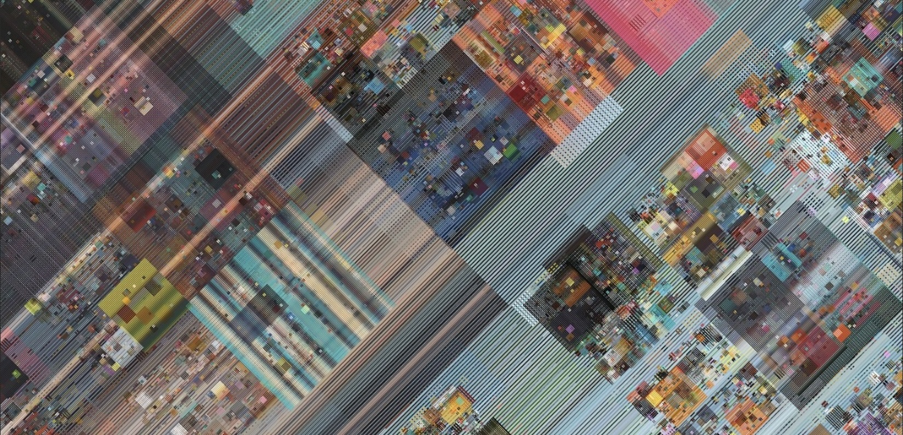

# VIS 42 - Intro to Creative Code - Winter 2026
[Schedule](#topics-and-schedule) | [Description](#description) | [Resources](#resources) | [Grading](#grading) | [Policies](#policies) | [References](#references)

# ⚡️ ⚡️  updates in progress - see you on tuesday ⚡️ ⚡️ 

  

<small>_detail of CSRSNT-CAAI-038-of-128.png, [csrsnt](https://www.instagram.com/csrsnt/) (Casey Reas), 20 April 2021_</small>

# Description

This course provides students with a foundation in programming and computational thinking, and their application in creative projects. Topics covered may include generative graphics and sound, interactive media, and others. Students will gain practical skills through hands-on experience and experimentation, learning to integrate computing into artistic practices. No prior programming experience is required.

## Details

- **Instructor**: Dr. Robert Twomey
- **Class**: Tu/Th 9:30-10:50 AM
- **Location**: York 2622 ([map](https://map.concept3d.com/?id=1005#!m/237193?share))
- **Office Hours**: TBD likely Monday/Wednesday

## Teaching Team
- **Graduate TA**: Sarah Bricke
- **Graduate TA**: Mavyn Vu

**Prerequisites**: None

# Tools
We will use the open source creative coding language [p5.js](https://p5js.org/) within a jupyterlite environment. Try it out [here](https://p5nb.vercel.app/tree/index.html)!

# Resources
- **Canvas**: [https://canvas.ucsd.edu/courses/69603/](https://canvas.ucsd.edu/courses/69603/) 
(_used for everything: daily announcements, links to lectures, assignments, discussions_)
- **Notebooks**: [link TK] (_lectures and other resources are shared here as jupyter notebooks_)
- **Discord**: See Canvas for link (_informal discussion, questions, peer support_)
- **Zoom**: See Canvas for link (_used individual meetings, any remote instruction_)

## Required Materials
You will need access to a laptop or other computer. I recommend a notebook specifically for taking notes, drawing ideas, “writing” code, etc.

# Format
- Plan to spend ~9 hours outside of class on coursework each week. (4 credit course ~ 12 hours of work time)
   - Labs -  ~1-2 hour
   - Projects -  ~3-5 hours
   - Reflection, peer reviews - .5 hour
- Each week, you will have a lab, a project, and some weeks you will have peer reviews.
   - Labs are due before Thursday’s class.
   - Projects are due Monday night at midnight.
   - Peer reviews are due before Thursday’s class (you have from Tuesday morning - Thursday before class)
- Late work will be penalized. **See [Late Work](#late-work) policy below.**

The emphasis of this class is on regular, weekly coding practice, self-expression, reflection, and peer community/support.

# Educational Objectives
At the end of the course, students will be able to:
- Read and write code with p5.js
  - Demonstrated through effective use of the p5.js language in exercises and assignments
- Understand key programming concepts
  - Functions, variables, operators, conditionals, loops, arrays
- Create digital artworks using emerging technologies, informed by precedents from the history of art and technology.
- Describe work and document process. 
  - Demonstrated through descriptions and reflections on exercises and peer reviews.
- Demonstrate efficacy in computational thinking core components (see computational thinking)
  - Decomposition, pattern recognition, abstraction, algorithmic thinking, generalization, evaluation
- Structure projects, name files, comment code, document outputs, and submit assignments according to professional and ICAM standards.

# Topics and Schedule

| Week | Day | Topics |
| --- | --- | --- |
| Week 0 | Sept 25 | What is creative code?; Why p5?   Web editor overview // jupyter lite;  submitting homework |
| Week 1 | Sept 30 | 2D coordinate plane; using p5 drawing functions; shapes; colors; custom shapes; |
| | Oct 2 | creating functions; curves(); |
| Week 2 | Oct 7 | Variables; operators; conditional statements (if); arcs(); |
| | Oct 9 | if else; if/else if; visual plotting; interactivity functions (mouseX, mouseY, mouseIsPressed); map(); counters and conditions;|
| Week 3 | Oct 14 | more map(); complex conditionals; basic images; |
| | Oct 16 | GIFs and tint(); random(); mousePressed(); | 
| Week 4 | Oct 21 | for loops |
| | Oct 23 | nested loops; visual patterning nested; | 
| Week 5 | Oct 28 | Array, iterating; random() selection; |
| | Oct 30 | pixels as Array; Array of pictures | 
| Week 6 | Nov 4 | Transformations: translate, rotate, scale |
| | Nov 6 |  NO CLASS - WORK TIME |
| Week 7 | Nov 11 | NO CLASS - VETERANS DAY |
| | Nov 13 | 3D: primitive shapes, coordinate plane | 
| Week 8 | Nov 18 | 3D: advanced (lights, materials, loading models) | 
| | Nov 20 | Video (finding, adding, and using video methods) | 
| Week 9 | Nov 25 | P5 sound library - Music Player; create a Music Video - amplitude() |
| | Nov 27 | NO CLASS - THANKSGIVING | 
| Week 10 | Dec 2 | DOM and html5 |
| | Dec 4 | p5-notebook (jupyterlite) to html and web IDE; Presenting work through web; Choose a project to post to class website vis42.org | 
| Finals Week | Dec 7 | All late work due end of day (11:59pm) Sunday for partial credit. EMAIL TA to request regrades. |
| | Dec 9 | Project 10 due end of day (11:59pm) Tuesday. No class meeting |

<!-- outtakes
OOP or other advanced topics 
-->

## Assignments
Every week* you will have the following assignments: 
- 1 Lab
  - Assigned during Tuesday class
  - ~1-2 hour
  - Due before Thursday Class
- 1 Project 
  - Assigned during Thursday class 
  - ~ 3-5 hours
  - Due Tuesday before class
- 1 SOAR Reflection (Due with Project submission) ~ 15-30 minutes
- 2 Peer reviews (of Projects) ~ 15-30 minutes

*Towards the end of the semester, we’ll have one or two longer projects.

# Grading
- 20% Labs (10 weekly labs, graded on completion 5/5pts)
- 60% Projects (10 weekly homeworks, graded on concept, execution, experimentation 10/10pts)
  - two larger projects may take the place of homework.
- 10% Reflections (10 weekly reflections, 1 per homework)
  - 2/2pts graded on completion, following SOAR format
- 10% Participation (Peer Reviews, attendance)
  - graded on completion

## Grading Scale
A+ = 97-100 | A = 94-97 | A- = 90-94  
B+ = 87-90 | B = 84-87 | B- = 80-84  
C+ = 77-80 | C = 74-77 | C- = 70-74  
F = below 70% 

## Project Grading Details

Work will be evaluated on the _quality of concept_, the _degree of experimentation_ (aesthetic and technical), and the _final realization_ (again, aesthetic and technical).

**A – Excellent**
Excellent projects present _clear, original, and compelling_ concepts. They demonstrate _strong experimentation_—pushing both aesthetic and technical boundaries—and result in a _highly resolved, polished final work_. The project reflects a deep engagement with the assignment prompt and an ambitious creative vision. You’ve thoughtfully integrated feedback and shown critical awareness of your process and outcome.

**B – Good**
Good projects present _well-developed_ and _thoughtful concepts_. They show _solid experimentation_ with some risks taken, and result in a _well-executed and coherent final work_. The project meets all requirements and demonstrates care and understanding in both craft and presentation. Feedback has been applied effectively, though not always extensively.

**C – Satisfactory**
Satisfactory projects present _clear but limited concepts_. Experimentation is present but _conventional or uneven_, and the final realization may feel _incomplete or underdeveloped_. The work meets basic requirements but lacks depth, polish, or full engagement with the creative potential of the assignment. Feedback may not have been fully addressed.

**F – Failing**
Failing projects show _minimal concept development_, _little to no experimentation_, and _poor or incomplete realization_. The work may not meet assignment requirements, demonstrate technical competence, or communicate a clear idea. It reflects a lack of engagement with the project’s creative and developmental process.

# Policies

Course-specific policies and rules.

| [ICAM Policies](#icam-policies) | [Reflection](#reflection) | [Peer Review](#peer-review) | [Attendance](#attendance) | [Late Work](#late-work) | [Academic Integrity](#academic-integrity) | [Other People's Code](#other-peoples-code) | [UCSD Course Policies](#ucsd-course-policies) |

## Reflection

In the text box below, write a reflection (4 sentences minimum):

- `Subjective` - How did today (coding this project) feel? Did you accomplish your creative goals
- `Objective` - describe your process. How did you go about completing the project?
- `Actions` - What did you learn from today's experience that you can take moving forward?
- `Reflection` - any overall reflection - how are things progressing, generally? how does this work fit into your broader creative vision?

## Peer Review
Answer at least two of the Peer Review questions below, in response to your peer’s project. Take care to not just Evaluate. (4 sentences)
- `Describe` - What do you see?
- `Analyze` - How is it made? How does it make you feel or think about?
- `Interpret` - What is it about? What’s the main idea being explored?
- `Evaluate` - Is it successful? Does it explore the prompt in a compelling, interesting, or unique way?

## ICAM Policies
File naming conventions and submissions. More [TK].

## Attendance
On-time attendance is required as well as work inside and outside of section. Please notify your instructor in advance if you must be absent for illness or family emergency. Any absences must be cleared with the instructor, or justified with written documentation (e.g. letter from team, etc.). We do not differentiate between mental and physical health and in either case please be in communication for when you need to take a day off. **After a student misses a week’s worth of classes each subsequent missed class will result in the reduction of the final grade by a full letter grade (i.e., A to B, B- to C-).** Excessive tardiness or leaving early will also impact your grade and will follow the same rubric.

On-time attendance is required. Lateness or leaving early, when not cleared with the instructor, will also impact your participation grade. Lateness will be counted as 80% for your participation grade for the day.

## Late Work 
**Late Work Grading Policy**. Late work will be docked 5% for each day they are late (if an assignment is two days late, the grade will be docked 10%). An assignment submitted after the due date time on the due date will still be docked 5%. The lowest possible grade for late work is 70%, which means that for an assignment submitted more than 6 days late, no more than 30% will be docked, but the maximum grade you will receive is 70%. Details about submission format and due date are given in Canvas. 

**Excused Late Work**. Requests to submit late work for special circumstances must be approved by your instructor at least 24 hours before the due date and time. Any late requests made less than 24 hours before the assignment is due may still be subject to a lateness penalty. We do not distinguish between mental and physical health. **Email your instructor, 24 hours in advance, explaining generally the reason you are missing class and your plans for making up any missed lecture, activity, and assignment**. 

An assignment may receive an F if a student does not participate in every phase of the development of the project and meet all deadlines for preliminary materials (proposals, drafts, etc.).  Failure to submit any of the graded course assignments is grounds for failure in the course.  

## Academic Integrity
Integrity of scholarship is essential for an academic community. The University expects that both faculty and students will honor this principle and in so doing protect the validity of University intellectual work. For students, this means that all academic work will be done by the individual to whom it is assigned, without unauthorized aid of any kind. [http://senate.ucsd.edu/Operating-Procedures/Senate-Manual/Appendices/2](http://senate.ucsd.edu/Operating-Procedures/Senate-Manual/Appendices/2)

## Other People’s Code
**If you use a piece of code from the p5 reference or another piece of publicly available code, you must cite your use of it at the top of your code file as a comment**. Include a link to the original code file, the author, and the date. 

**This includes generated code**. You are allowed to use LLMs, [TritonGPT](https://blink.ucsd.edu/technology/ai/tritongpt/index.html), other Generative AI tools as part of your coding process, however **you must disclose this usage**. Add comments in your code indicating which parts were generated, and how you asked the system to help.

## UCSD Course Policies
Students are responsible for knowing the university academic policies and resources found on [this page](https://catalog.ucsd.edu/academic-regulations.html):
- Adding and dropping courses
- Exams
- Grades and grade points

## Students with Disabilities
Students registered with the Office for Students with Disabilities are to provide copies of their AFA letters to both the course instructor and the OSD Liaison of the Visual Arts Department . If you have any questions about utilizing your OSD accommodation, please contact Dept. OSD Liaison at vis-ug@ucsd.edu or 858-534-2860. You may also contact the Office of Students with Disabilities directly at osd@ucsd.edu or 858-534-4382. [http://disabilities.ucsd.edu/](http://disabilities.ucsd.edu/)

## Land Acknowledgment
This public acknowledgment serves to honor and respect Indigenous peoples and their land on which our campus resides. UC San Diego was built upon the territory of the Kumeyaay Nation. From time immemorial, the Kumeyaay people have been a part of this land. Today, the Kumeyaay people continue to maintain their political sovereignty and cultural traditions as vital members of the San Diego community.

# References
- [Code as a Creative Medium](https://mitpress.mit.edu/9780262542043/code-as-creative-medium/) by Tega Brain and Golan Levin (2021)
