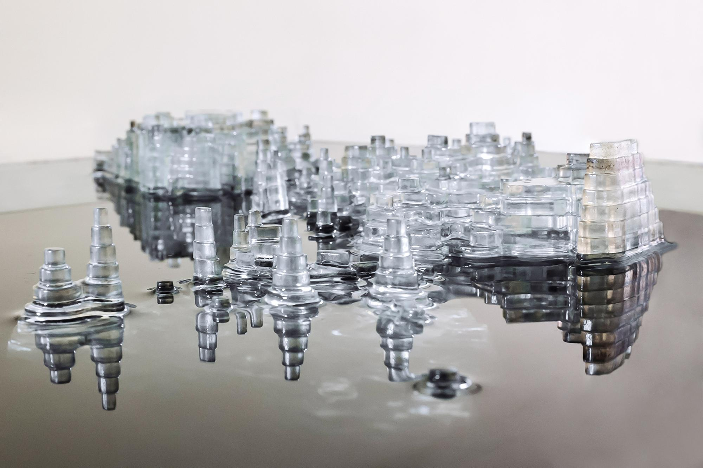

# Flat Pack Future

This project is about building 3d form using 2D materials. On the laser cutter we can cut flat stock (corrugated cardboard, matte board, architectural plywood, acrylic). The trick is desinging flat parts that can be assembled to make a 3D structure. This technique is probably most familiar to you from wooden models (see the dinosaur above). In terms of form, this exercise is very open ended -- you do not need to make a dinosaur.

 

For this assignment you can predominantly do 2D free-form drawing in Rhino, so long as you are sure to include some tabs and slots so that those drawings can be assembled after they are cut. Or stack of contours.

 

Learning Goals:
 
- Gain experience with laser cutting flat materials. 
- Experience using calipers to measure the thickness of materials. 
- Experience iterating on designs with Rhino and the Laser Cutter, until the parts fit.
- Thinking in two and three dimensions. 
- Thinking through fabrication processes in relation to CAD software (RHINO) and designing 3d forms. 

# Process
1. Ideation
   - What kind of a form do you want to make? (Discuss)
2. Design
   - Refer to our week 1 - 3 course materials.
   - You will create a complete 2D layout for your part in Rhino. 
   - You do not necessarily need to assemble it in 3D in Rhino. (Though if it helps you to think through how the piece will go together, then extrude your outlines as 2D parts, and rotate/translate/assemble them in 3D)
3. Fabrication
   - You need to actually fabricate this assignment from some flat material. 
     -  Acrylic, Cardboard, Matt Board, Paper.
   - Learn to schedule time on Envision/DIB laser cutters.

# Submission
1. Documentation:
   - Take screenshots of your 2d designs
   - Photos/videos to document your fabrication and assembly process
   - SVG export of your final design, formatted to run on any laser cutter. (remember to hide extraneous layers)
   - Photographs of your final product, assembled. Follow good documentation procedure.
2. Sketchbook Updates:
   - sketches; screenshots of 2D designs; process images/videos; photos of final product; any notes, narrative about process.
3. Submission: 
   - Photographs of the final product
   - SVG file of your cutting templates
   - Rhino file (3DM)
   - Upload all of these files to Canvas
     - (use the naming convention _p1_Lastname_1.jpg_ and _p1_Lastname.svg_ _p1_Lastname.3dm_ for the files.)

DUE 10/29 (Tuesday) to Canvas: [https://canvas.ucsd.edu/courses/60628/assignments/856576](https://canvas.ucsd.edu/courses/60628/assignments/856576)

# References

David Cerney [K](https://www.thisiscolossal.com/2016/05/a-rotating-42-layer-sculpture-of-franz-kafkas-head-by-david-cerny/) (kinetic Head of Franz Kafka)

---

Ekene Ijeoma - [Wage Islands](https://www.designboom.com/architecture/ekene-ijeoma-wage-islands-storefront-for-art-and-architecture-chicago-architecture-biennial-11-03-2015/)

---

[Nomadic Furniture](https://www.core77.com/posts/42562/Nomadic-Furniture-DIY-Designs-from-the-1970s#)

---

Joseph Delappe [Thoughts and Prayers](https://www.delappe.net/low-polygon-sculptures)

---