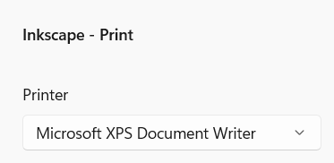
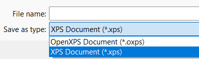

# Laser Cutting Guide
With the large 100 Watt FSL Laser at Envision.

# Checklist
1. Open your design in Inkscape on the Laser computer
2. Start the FullSpectrum software.
3. Print to FullSpectrum from Inkscape. 
4. Check your Vector and Raster settings in Full Spectrum (___speed___, ___power___, ___current___, and print order)
   - change print order so you do raster cuts then vector cuts. Do cut outs (outside perimeter) last.
5. Connect the laser cutter
6. Home the laser
7. Raise the lid of the laser cutter and put your stock material in. 
   - (if using acrylic, remove the protective sheet on your material)
8. Secure your material (heavy metal weights or blue tape)
9. Postion the brass level sensor over your material, and Z level to set the material height.
10. Trace the job perimeter (make sure it fits on the stock)
11. Run your cut!

(Adapted from Giovanni's excellent checklist!)

# Detailed Laser Cutting Principles

__1. Laser basics__
- Safety (air filtration; fire safety)
- __ALWAYS__ z-height level your material (brass tip in front of cutting head) before cutting your piece

__2. Material choice__
- ___Good___ materials for laser cutter:
  - thick papers (card stock, manilla folder, index cards, office paper, watercolor paper, bristol board, vellum)
  - thin cardboard (poster board, matte board, corrugated cardboard - i.e. cardboard boxes)
  - plastic sheets (acrylic, ABS)
  - wood (architectural plywood, balsa wood, thin birch plywood, veneers) 
  - engraving on leather
  - textiles
- ___Bad___ materials:
  - anything vinyl (PVC plastic tube and sheet, vinyl decals)
  - polystyrene (i.e. styrofoam, packing peanuts)
- What other materials do you have questions about?

__3. Laser Settings__
- For any given material, we need to find the right power settings. 
- There are three parameters we set: __Speed__, __Power__, __Current__.
  - (see the chart at the bottom fo the page for some starting points for different materials)
- We can do formal tests to find the best parameters. See this [Materials Test](http://laser101.fslaser.com/materialtest) procedure.
  - (we can also do this a little more informally) 
  - Blog post about finding [Laser Settings for Cutting](http://blog.fslaser.com/experts/muse-workflow-laser-settings-for-cutting)
- Over time, we (as a class) will come up with our own materials settings that work well with our laser cutter. 
- So, __log your cuts__: (date, type of material, thickness, power settings)
  - (we need this to build our library of materials and settings)

__4. Cut Types__
- Engraving vs Cutting: 
  - __Engraving__: marking patterns into the surface of a material (faster, lower power, can engrave materials like glass, stone that can't be cut through)
  - __Cutting__: cutting through the material. (slow, higher power, smokes/catches fire)
  - The difference is whether you are cutting through the material or marking the surface.
  - The power of our laser tube (100 Watts) determines what thickness we can cut through. Higher power lasers (65-75W, 100W) can cut through thicker materials. But there are still limits. A fiber laser is a whole different laser type that can cut through 0.25" plate steel, for instance.
- There are three main operations we will do: 
  - __Vector Cutting__: cutting shapes out of materials. **this is the bulk of what we will do**. SVG files. 
  - __Vector Engraving__: using vector art to mark the surface. designs, patterns, cross-hatching. SVGs.
  - __Raster Engraving__: rendering a bitmap on the surface of something, row by row like an old school printer. BMPs.
- In the laser cutter software, "Cutting" and "Engraving" are both called Engraving. We just choose different power settings for the layers. See the chart at bottom of the page.
 
 

## Design Preparation

__Design Preparation__: 
1. In Rhino, create new file from template. Choose "Small objects inches".
2. Draw your design in 2d, using layers:
   - red layer for vector cutting
   - blue layer for vector engraving
   - black layer for raster engraving (bitmaps)
3. Optional: Extrude your layers to the thickness of your material, to see what this would look like __as cut__. 
   - (f.ex. for 1/8" birch plywood you would extrude it to something like 0.125" thick. you can use your calipers to check these measurements)
5. Exporting from Rhino as a Scalable Vector Graphics (SVG) file. 
6. Save to your USB drive.

Plan A: File Format Conversion with Envision Windows Computer

1. On the lab coputer in Envision, open your SVG file in Inkscape or Illustrator. 
2. Print the file. Select the **Microsoft XPS Document Writer** as the printer:
  - 
3. Save as XPS file. When saving, make sure you select XPS and deselect OpenXPS (the default setting)
   - 
4. Copy the XPS file to your USB drive.

Plan B: Open the file directly in Inkscape on the Laser Cutter machine.

## Cutting Process

**NOTE: This will be updated with more accurate detail as we use the laser.**

The laser cutter has its own engraving software.  We will use it from the workstation next to the laser.

__Cutting Workflow__:
1. On the laser cutter computer, import your XPS file design from the USB drive.
2. Import the design (SVG file). We will use HW1.
3. Place your material in the laser cutter
4. Secure your material (heavy metal weights or blue tape)
5. Change your line colors/layer colors, if you need to.
6. Change your scale/placement, if necessary. 
7. Set the cutting properties and your engraving properties. 
8. Change the order of the operations: engraving first (blue), then cutting (red).
8. **ALWAYS** Set the z-height of the material before you run the design.
9. Run the job.

# Reference
## 2D computer controlled cutting
- [MIT's How to Make (Almost) Anything computer controlled cutting resources] (http://academy.cba.mit.edu/classes/computer_cutting/index.html)
- [FLAT FAB](http://flatfab.com/)
- [Cuttle](https://cuttle.xyz/)

## Our Laser Cutter
- FSL 100W Laser
- Laser #2

## Laser Cutter Software
- RetinaEngrave Software:
  - [quick reference guide](https://info.fslaser.com/hubfs/Public_Documents/RetinaEngrave%20v3.0%20RefGuide.pdf)  
  - [Video Tutorials](https://www.youtube.com/playlist?list=PL_1I1UNQ4oGa0w55C772Y1mC6F4f3ZcG6)
  - [RE3.0 Manual](https://info.fslaser.com/hubfs/Public_Documents/RetinaEngrave%20v3.0%20Manual.pdf)