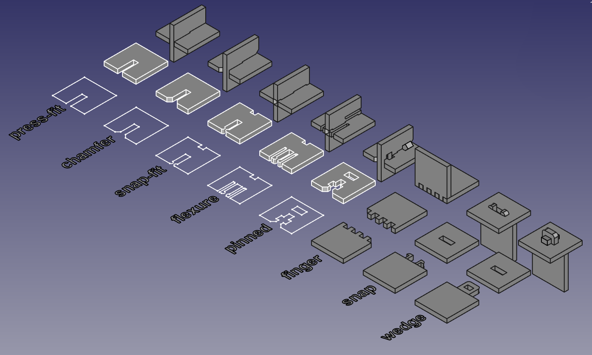
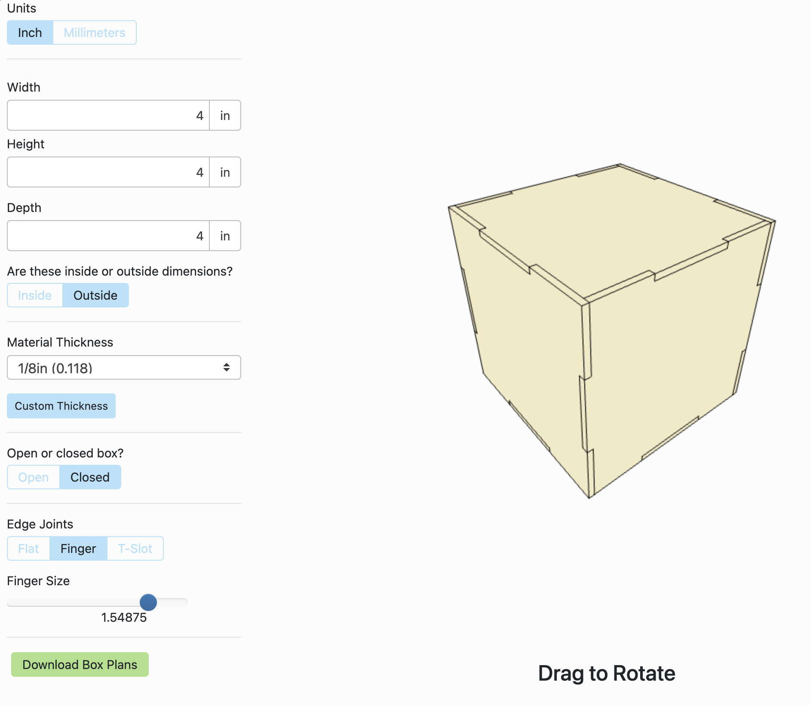

# Week 1.2 - Laser Cutter

## Agenda
- [Artist of the Day](#artist-of-the-day)
- Topics
  - [Laser Cutting Principles](#laser-cutting-principles)
  - [Cutting Process](#cutting-process)
  - [Design for Laser Cutter](#design-for-laser-cutter)
  - [Joining Flat Material](#joining-flat-material)
  - [Example - Two Slots](#example-two-slots)
  - [Box Generator](#box-generator)
- [Homework](#homework)
  - [Exercise 1.5: Fabricate the Stencil](exercises/ex1#part-2-fabricate)
  - [Exercise 2: 3D Tab and Slot](exercises/ex2) ([canvas](https://canvas.ucsd.edu/courses/60628/assignments/864451))

## Artist of the Day

[Metropol Parasol // Setas de Seville](https://www.yatzer.com/Metropol-Parasol-The-World-s-Largest-Wooden-Structure-J-MAYER-H-Architects) by J Mayer H Architects (2011) Worlds largest gluelam structure.

## Laser Cutting Principles

### **Follow the updated [Laser Cutting Guide](../references/laser-cutting.md) here.**

Initial presentation: 

__1. Laser basics__
- Safety (air filtration; fire safety)
- __ALWAYS__ z-height level your material (brass tip in front of cutting head) before cutting your piece

__2. Material choice__
- _Good_ materials for laser cutter:
  - thick papers (card stock, manilla folder, index cards, office paper, watercolor paper, bristol board, vellum)
  - thin cardboard (poster board, matte board, corrugated cardboard - i.e. cardboard boxes)
  - plastic sheets (acrylic, ABS)
  - wood (architectural plywood, balsa wood, thin birch plywood, veneers) 
  - engraving on leather
  - textiles
- _Bad_ materials:
  - anything vinyl (PVC plastic tube and sheet, vinyl decals)
  - polystyrene (i.e. styrofoam, packing peanuts)
- What other materials do you have questions about?

__3. Laser Settings__
- For any given material, we need to find the right power settings. 
- There are three parameters we set: __Speed__, __Power__, __Current__.
  - (see the chart at the bottom fo the page for some starting points for different materials)
- We can do formal tests to find the best parameters. See this [Materials Test](http://laser101.fslaser.com/materialtest) procedure.
  - (we can also do this a little more informally) 
  - Blog post about finding [Laser Settings for Cutting](http://blog.fslaser.com/experts/muse-workflow-laser-settings-for-cutting)
- Over time, we (as a class) will come up with our own materials settings that work well with our laser cutter. 
- So, __log your cuts__: (date, type of material, thickness, power settings)
  - (we need this to build our library of materials and settings)

__4. Cut Types__
- Engraving vs Cutting: 
  - __Engraving__: marking patterns into the surface of a material (faster, lower power, can engrave materials like glass, stone that can't be cut through)
  - __Cutting__: cutting through the material. (slow, higher power, smokes/catches fire)
  - The difference is whether you are cutting through the material or marking the surface.
  - The power of our laser tube (100 Watts) determines what thickness we can cut through. Higher power lasers (65-75W, 100W) can cut through thicker materials. But there are still limits. A fiber laser is a whole different laser type that can cut through 0.25" plate steel, for instance.
- There are three main operations we will do: 
  - __Vector Cutting__: cutting shapes out of materials. **this is the bulk of what we will do**. SVG files. 
  - __Vector Engraving__: using vector art to mark the surface. designs, patterns, cross-hatching. SVGs.
  - __Raster Engraving__: rendering a bitmap on the surface of something, row by row like an old school printer. BMPs.
- In the laser cutter software, "Cutting" and "Engraving" are both called Engraving. We just choose different power settings for the layers. See the chart at bottom of the page.
 

## Cutting Process

**NOTE: This will be updated with more accurate detail as we use the laser.**

The laser cutter has its own engraving software.  We will use it from the workstation next to the laser.

__Design preparation__: 
1. Create Design in Rhino. 
2. Export from rhino as Scalable Vector Graphics (SVG) file. 
3. Save to your USB drive.
4. On the lab coputer in Envision, import your SVG in Illustrator. 
5. Print the file. Select [fill in here], paper size is 36x48". 
6. Save as XPS file. Make sure you deselect OpenXPS (the default setting)
7. Copy to your USB file.

__Cutting Workflow__:
1. On the laser cutter computer, import your XPS file design from the USB drive.
2. Import the design (SVG file). We will use HW1.
3. Place your material in the laser cutter
4. Secure your material (heavy metal weights or blue tape)
5. Change your line colors/layer colors, if you need to.
6. Change your scale/placement, if necessary. 
7. Set the cutting properties and your engraving properties. 
8. Change the order of the operations: engraving first (blue), then cutting (red).
8. **ALWAYS** Set the z-height of the material before you run the design.
9. Run the job.

## Design for Laser Cutter

__Simple Laser Cutter Design__
1. Create new file from template. Small objects inches.
2. Drawing in 2d, using layers:
  - red layer for vector cutting
  - blue layer for vector engraving
  - black layer for raster engraving (bitmaps)
3. Optional: Extrude your layers to the thickness of your material, to see what this would look like __as cut__. 
   - (f.ex. for 1/8" birch plywood you would extrude it to something like 0.125" thick. you can use your calipers to check these measurements)
5. Exporting to SVG.

## Joining Flat Material

[Watch a nice video on types of laser cut joints](https://www.youtube.com/watch?v=hnjp_vy2vIk)

[My old video of Tab and Slot construction](https://drive.google.com/file/d/1qYg0IhXUCxTLidSLCeeEyQ5svpr8FyST/view?usp=sharing)

How can we build 3d structure with 2d materials? 

### Press Fit Joints
__Half-lap__

One good way to do this is tab and slot construction. (also called finger joints)

- You need to design 2d parts that have holes (slots), and other parts that have tabs, so that when cut from flat materials you can assemble them into 3d forms.
- Optional: Extrude your designs to the thickness of the material, to make solids. Assemble these solides in Rhino to mock up your 3d form.

#### Measure the Thickness of your Materials

Use your calipers!

- Sparkfun video on: [How To Use Calipers](https://www.youtube.com/watch?v=73YJA5giZfs) (youtube)
- When making mating pieces, do cutting tests to verify that the measured dimensions match the expected dimensions.

#### Process for a Joint
1. Draw the two parts you want as outlines/2d shapes.
2. draw a line on each peice where you want the joint to be. (Rhino **[line](https://docs.mcneel.com/rhino/7/help/en-us/index.htm#commands/line.htm)** command
3. Offset the joint line by the thickenss of the material to make the slots. (Rhino **[offset](https://docs.mcneel.com/rhino/7/help/en-us/index.htm#commands/offset.htm)** command)
  - Use line 
4. Trim the original 2d shapes using your slots. (use the Rhino **[trim](https://docs.mcneel.com/rhino/7/help/en-us/index.htm#commands/trim.htm)** command)
5. Draw any extra lines you need to make the piece water tight. 
6. Use the Rhino **[join](https://docs.mcneel.com/rhino/7/help/en-us/index.htm#commands/join.htm)** command to connect the new outline back into one piece.

## Example Two Slots

Rhino file: [two_slots.3dm](../examples/two_slots.3dm)

## Box Generator

Makercase box generator: [https://en.makercase.com/#/basicbox](https://en.makercase.com/#/basicbox)

## Homework 
- [Exercise 1.5: Fabricate the Stencil](../exercises/ex1#part-2-fabricate) ([canvas submission](https://canvas.ucsd.edu/courses/60628/assignments/864429)) DUE Tuesday 10/8
- [Exercise 2: 3D Tab and Slot](../exercises/ex2) ([canvas submission](https://canvas.ucsd.edu/courses/60628/assignments/864451)) DUE Thursday 10/10

## References
- Online Video Tutorials:
- Finger joint laser cut box: [https://www.youtube.com/watch?v=FBSQGHBpBWg](https://www.youtube.com/watch?v=FBSQGHBpBWg)
- Finger joint tutorial in Rhino with boolean operations: [https://www.youtube.com/watch?v=AYxUUSWIRW4](https://www.youtube.com/watch?v=AYxUUSWIRW4)
- [Nomadic Furniture](https://www.core77.com/posts/42562/Nomadic-Furniture-DIY-Designs-from-the-1970s#)
- [Book 1](https://www.amazon.com/Nomadic-Furniture-Victor-Papanek/dp/039470228X)
- [Book 2](https://www.amazon.com/Nomadic-Furniture-2-James-Hennessey/dp/0394706382)
