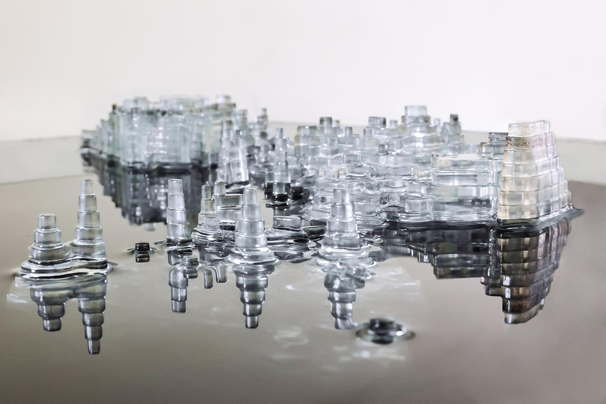
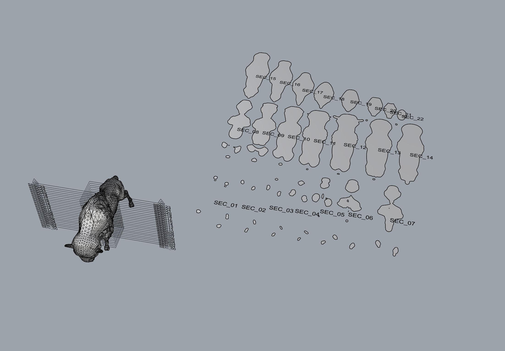

# Week 2.1 - Laser to 3d: Stacked Contours

## Agenda

- [Artist of the Day](#artists-of-the-day)
- [Extruding Curves](#extruding-curves)
  - Example File: [Extruding curves](#example-file-extruding-curves)
  - Video Demo: [Extrusion](#video-demo-extrusion)
- [Stacked Contours from a Mesh](#stacked-contours-from-mesh)
  - [Working with meshes](#working-with-meshes)
    - Example File: [Creating Meshes](#example-file-creating-meshes)
  - [Importing meshes](#importing-meshes)
    - Example File: [Buffalo Contours](#example-file-buffalo-contours)
    - Example File: [Sliced Pikachu](#example-file-sliced-pikachu)
  - Video Demo: [Extracting Contours from Mesh](#video-demo-extracting-contours-from-mesh)
- Homework  

## Artist(s) of the Day 

Ben Butler - [various projects](https://www.benbutlerart.com/)

---
 

Ekene Ijeoma - [Wage Islands](https://www.designboom.com/architecture/ekene-ijeoma-wage-islands-storefront-for-art-and-architecture-chicago-architecture-biennial-11-03-2015/)

---
 

Maya Lin - [Topologies](https://www.mayalinstudio.com/art/topologies)

---
 

## Extruding Curves
- We can **extrude** a 2d curve into 3 dimensions to see what it would look like as a flat object. 
  - [_ExtrudeCrv_](https://docs.mcneel.com/rhino/7/help/en-us/index.htm#commands/extrudecrv.htm) **<--- THIS IS OUR GOTO**
- Load up your tab and slot construction from last week (or make a new one).
- If you have not already, join the perimeters for each of the pieces so that you have continuous outlines. 
- Extrude the curves into three dimensions using Extrude Curve.
- Use the transformations and object snaps to assemble your pieces together into a virtual model: 
  - [_Move_](https://docs.mcneel.com/rhino/7/help/en-us/commands/move.htm)
  - [_Rotate_](https://docs.mcneel.com/rhino/7/help/en-us/commands/rotate.htm)
  - [_object snaps_](https://docs.mcneel.com/rhino/7/help/en-us/user_interface/object_snaps.htm)
- Take a screenshot ([_ViewCapture_](https://docs.mcneel.com/rhino/7/help/en-us/commands/viewcapture.htm#ViewCaptureToFile)) and save to file. 
  - Rotate the viewport to capture a number of different vantage points.
  - Experiment with the [_Display Options_](https://docs.mcneel.com/rhino/7/help/en-us/options/view_displaymode_options.htm) to choose an aesthetically pleasing render.

### Example File: Extruding Curves

Rhino file: [stacked_contours_offset.3dm](../examples/stacked_contours_offset.3dm)

Workflow: 
- draw some curves using the 2d drawing tools (Curve, Line, Trim/Join, etc.)
- [_Offset_](http://docs.mcneel.com/rhino/7/help/en-us/commands/offset.htm)
- [_ExtrudeCrv_](https://docs.mcneel.com/rhino/7/help/en-us/index.htm#commands/extrudecrv.htm)
- Move the curves into position, stacking them vertically.

### Video Demo: Extrusion

[Extrusion Demo](https://drive.google.com/file/d/1_4jbmbxfOe-ERyfx6CjA2BJhHy-UwzQz/view?usp=drive_link) (google drive video)

## Stacked Contours From Mesh

### Working With Meshes

__Solids vs. Meshes__
 
- Solids
  - what are they? (collections of surfaces)
  - explode, cap
  - when we export STL we are creating a mesh
- Meshes
  - Create meshes directly

### Example File: Creating Meshes

Rhino file: [solids_meshes.3dm](../examples/solids_meshes.3dm)

### Importing Meshes
- Importing - Import
  - STL file - Stereolithography ([wikipedia definition](https://en.wikipedia.org/wiki/STL_(file_format)))
  - [buffalo.stl](../examples/buffalo.stl)
  - **Rotate**, **Scale**, and translate as necessary to find and position the object. Also, [Zoom Extents](http://docs.mcneel.com/rhino/7/help/en-us/commands/zoom.htm#Extents)
- Simplification (MeshReduce)
  - [buffalo_reduction.3dm](../examples/buffalo_reduction.3dm)
- Edit directly - **[PointsOn](http://docs.mcneel.com/rhino/7/help/en-us/commands/pointson.htm)**, and directly manipulating points on the mesh.
- Closed vs Open Meshes
  - We need closed meshes for 3DP. Object properties will tell you if a mesh is an open or closed mesh.
  - Attempt to patch an open mesh: **Mesh** -> **Repair Tools** -> **Fill All Holes**
  - Rhino [Mesh Repair](http://docs.mcneel.com/rhino/7/help/en-us/commands/meshrepair.htm) tools

### Extracting Contours from a Mesh

__Clean up the Mesh__

- Importing and slicing a complex mesh
  - Finding a mesh (thingiverse.com)
  - Importing a mesh into rhino
  - Slicing a mesh with the contour command
  - slicing/design for digital fabrication (material thickness considerations)
- Simplifying mesh
  - [ReduceMesh](http://docs.mcneel.com/rhino/7/help/en-us/commands/reducemesh.htm)
- Go from mesh to unrollable surface: 
  - [MeshToNURB](http://docs.mcneel.com/rhino/7/help/en-us/commands/meshtonurb.htm)

__the NEW way__ (Rhino 8)

  - In the top view, select your object and create a [ClippingSection](https://docs.mcneel.com/rhino/8/help/en-us/commands/clippingplane.htm#ClippingSections) centered on the origin. 
  - In the front view, use [Array](https://docs.mcneel.com/rhino/8/help/en-us/commands/array.htm) to copy the sections. Try 1 for X, 24 for Y, 1 for Z. 
  - Select your stack of ClippingSections, and use [NestedClippingDrawing](https://docs.mcneel.com/rhino/8/help/en-us/commands/clippingplane.htm#NestedClippingDrawing) to create a flat layout of those clipped sections.

 Reference: see Sectioning for Fabrication [https://www.rhino3d.com/stories/fabrication/sectioning-for-fabrication/](https://www.rhino3d.com/stories/fabrication/sectioning-for-fabrication/)

### Example File: Buffalo Clipping Sections

Rhino file: [buffalo-clipping-sections.3dm](../examples/buffalo-clipping-sections.3dm)

__the OLD way__

- Slicing a 3d mesh or surface object into 2d stacks
  - the [contour](http://docs.mcneel.com/rhino/7/help/en-us/commands/contour.htm) command
  - [contour_command.3dm](../examples/contour_command.3dm)
  - [contour_shear_flatten.3dm](../examples/contour_shear_flatten.3dm)

### Example File: Buffalo Contours

Rhino file: [buffalo_contours.3dm](../examples/buffalo_contours.3dm)

### Example File: Sliced Pikachu

Rhino file: [sliced_pikachu.3dm](../examples/sliced_pikachu.3dm)

## Video Demo: Extracting Contours from Mesh

Video Demo [Meshes and extracting contours](https://drive.google.com/file/d/1X88VT5_L5-1gZ7oKHOcodeJW6JrbHYpH/view?usp=drive_link) (google drive video)

## Homework
- Finish [Exercise 2: 3D Tab and Slot](../exercises/ex2) ([canvas submission](https://canvas.ucsd.edu/courses/60628/assignments/864451)) DUE Thursday 10/10, Design and Fabricate

### Leftovers 
- Slicing / panelling tools (breaking 3d structure down into 2d components that can be assembled)
- Parametric design for kerfs and 3d structures (grasshopper)