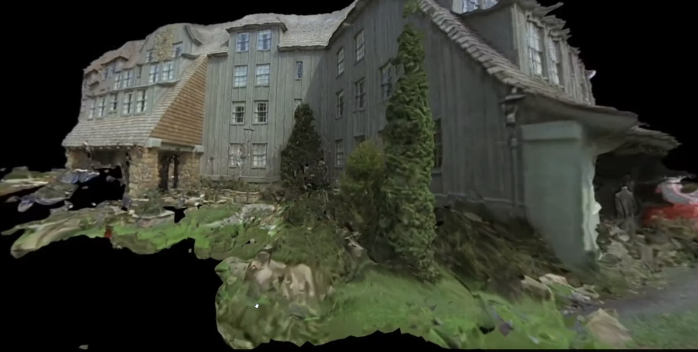
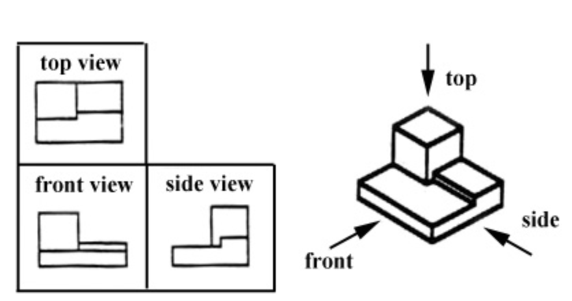

# Week 5.2 - Digitizing Objects

## Agenda
- Conclusion of Project 1 Critique
- [Artist of the Day](#artist-of-the-day)
- Hands On
	- [Measuring Objects](#measuring-objects)
	- [Dimensioning in Rhino](#dimensioning-in-rhino)
- Look at ex5 Trophies and discuss any complications
- [Homework](#homework)

## Artist of the Day

[Free Universal Construction Kit](https://fffff.at/free-universal-construction-kit/), The Free Art and Technology (F.A.T.) Lab

Claire Hentschker [website](http://www.clairesophie.com/)
- particularly photogrammetry work
- [Bedazzles](http://www.clairesophie.com/new-page-1)

## Measuring Objects
- Taking dimensions
  - Ruler
  - Tape measure
  - Digital Calipers. See [Sparkfun: How To Use Calipers](https://www.youtube.com/watch?v=73YJA5giZfs) (youtube link)
  - 3D Scanner
- Recording dimensions (pen and paper)
  - Multiview Perspectival: (top, front, side views all corresponding)
  - 
  - See the [MIT 2.007 Design and Manufacturing I](https://ocw.mit.edu/courses/2-007-design-and-manufacturing-i-spring-2009/) resource on [Design Handbook: Engineering Drawing and Sketching](https://ocw.mit.edu/courses/2-007-design-and-manufacturing-i-spring-2009/pages/related-resources/drawing_and_sketching/)

### Walk through Dimensioning Example

In class demonstration with calipers and pen and paper/whiteboard.

## Dimensioning in Rhino
- Strategies for building a dimensioned model in Rhino.
- Creating curves, surfaces, with exact dimensions (using text entry)
- Creating a 2d sketch/reference drawing layer, separate from 3d layer.
- Keep your sketches so you can "re-generate" the solids with slightly adjusted sizes, if you need to.
- Adding actual "dimensions" to a rhino model (to produce engineering drawings)

## Homework
- Submit documentation for [Project 1 - Flat Pack Future](https://canvas.ucsd.edu/courses/60628/assignments/856576) (DUE tomorrow 11/1 end of day)
- **HW** [Exercise 6: Digital Double](exercises/ex6) (DUE Thursday 11/7) **design and Fabricate**

## Resources
  - [MIT 2.007 Design and Manufacturing I](https://ocw.mit.edu/courses/2-007-design-and-manufacturing-i-spring-2009/) resource on [Design Handbook: Engineering Drawing and Sketching](https://ocw.mit.edu/courses/2-007-design-and-manufacturing-i-spring-2009/pages/related-resources/drawing_and_sketching/)
  - Drexel University - [dimensioned drawings on paper](http://www.pages.drexel.edu/~rcc34/Files/Teaching/MEM201%20L5-Fa0809-SpDimensions_RC.pdf)
